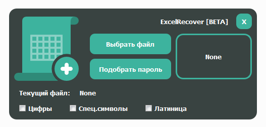

# ExcelRecover

Позволяет восстановить пароли от ваших xlsx документов.
Использует полный перебор паролей, без указания длины.
Но вы также можете использовать конфигурацию и указать программе,
какие значения нужно применять.
Когда пароль будет найден вы получите соответствующее уведомление.
Также будет создан новый xlsx документ который хранит расшифрованную версию.

